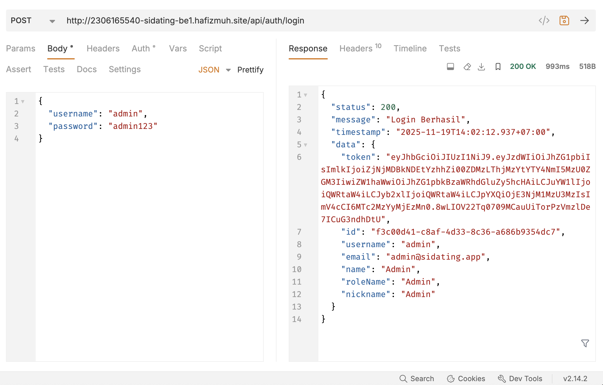
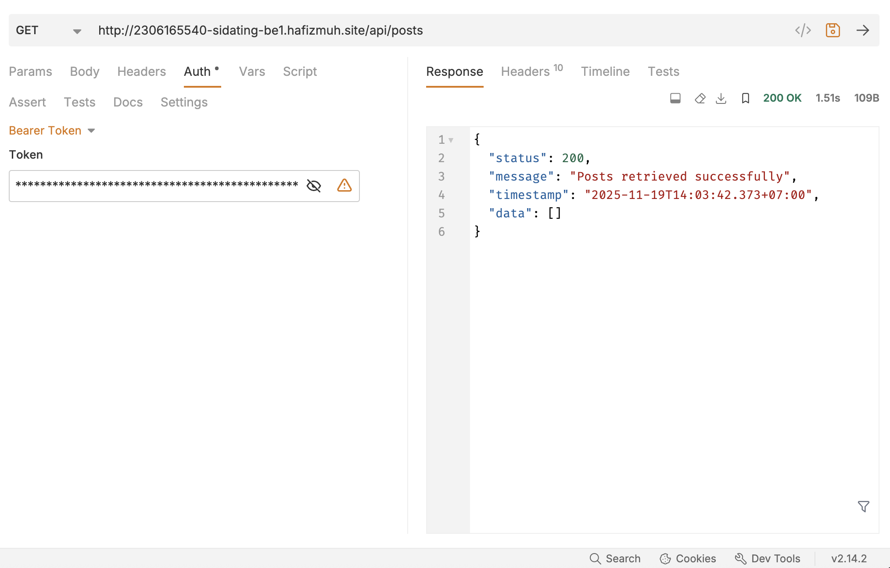
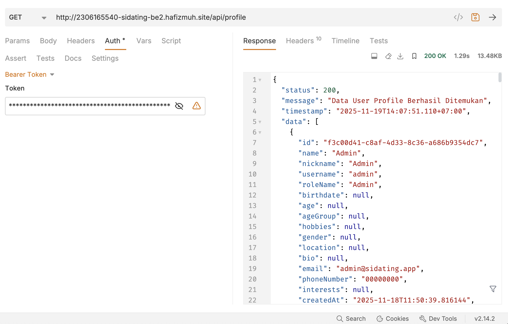
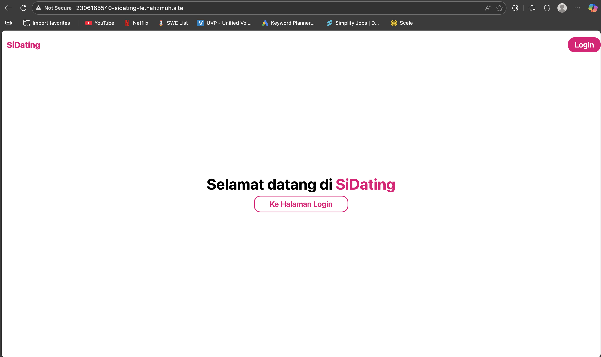
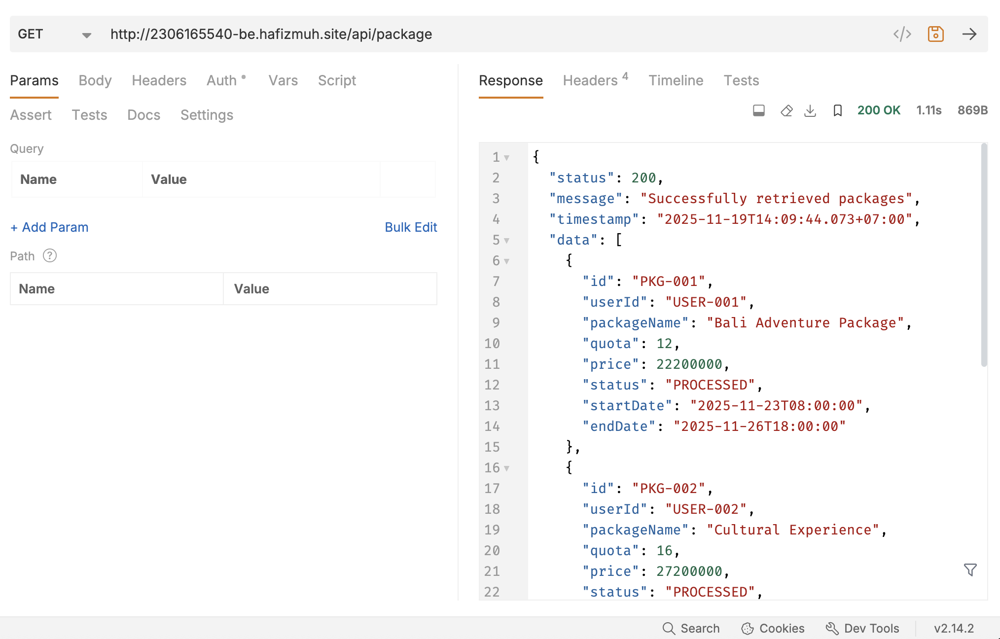
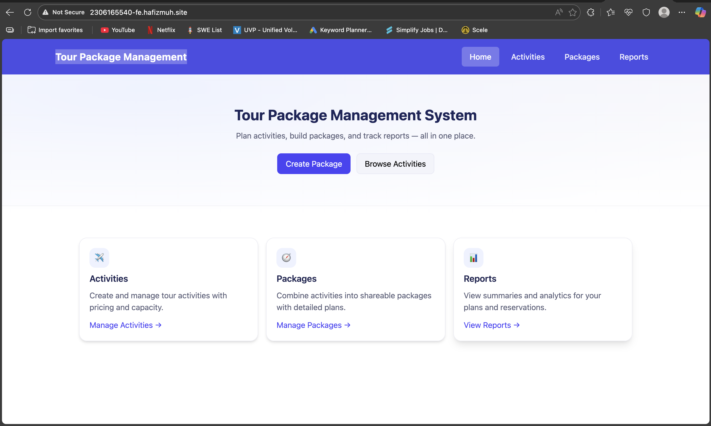
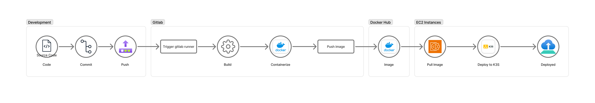
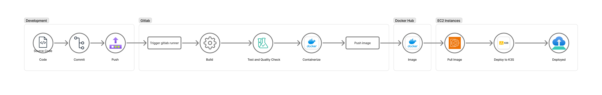

# Menjawab Pertanyaan Praktikum 9

1. Bukti Screenshot
Test BE 1 sidating

Test BE 2 sidating

Test FE sidating

Test BE Tugas Individu

Test FE Tugas Individu

2. Gambar Pipeline

Alur CI/CD ini dimulai secara otomatis ketika kode program di-push ke repository GitLab. Pada tahap Continuous Integration (CI), GitLab Runner mengompilasi kode Spring Boot menggunakan Gradle dan mengemasnya menjadi Docker Image, yang kemudian diunggah (push) ke Docker Hub. Selanjutnya pada tahap Continuous Deployment (CD), Runner mengakses server AWS EC2 melalui koneksi SSH aman untuk menerapkan konfigurasi Kubernetes terbaru. Server K3s kemudian secara otomatis menarik (pull) image baru tersebut dari Docker Hub dan melakukan rolling update pada Pod aplikasi, sehingga perubahan terbaru dapat langsung digunakan tanpa perlu proses manual.

3. Gambar Pipeline Improved

Gambar ini alur kerja Continuous Integration/Continuous Deployment (CI/CD) yang telah disempurnakan untuk meningkatkan kualitas dan keamanan perangkat lunak. Proses dimulai dari tahap development di mana pengembang melakukan push kode ke repositori GitLab, yang kemudian memicu GitLab Runner. Berbeda dengan pipeline sebelumnya yang hanya fokus pada build dan deploy, versi perbaikan ini menambahkan langkah krusial yaitu "Test and Quality Check" setelah tahap Build dan sebelum Containerize. Pada tahap ini, kode diuji fungsionalitasnya dan diperiksa kualitasnya secara otomatis, memastikan bahwa hanya kode yang lolos pengujian yang akan dikemas menjadi Docker image dan diunggah ke Docker Hub. Alur kerja diakhiri dengan proses deployment otomatis ke server EC2 menggunakan Kubernetes (K3s), di mana image terbaru ditarik dan dijalankan. Penambahan fase pengujian ini menjadikan pipeline lebih tangguh (robust) dan sesuai dengan standar industri karena meminimalkan risiko deployment kode yang bermasalah ke lingkungan produksi.

4. Mengapa Elastic IP? 
Elastic IP diperlukan untuk memberikan alamat IP publik yang statis (tetap) pada instance EC2 Anda. Tanpa Elastic IP, setiap kali instance dimatikan (stop) dan dinyalakan kembali (start), AWS akan memberikan IP publik baru secara acak. Hal ini akan memutuskan koneksi DNS domain Anda dan mengharuskan Anda mengubah konfigurasi akses SSH serta konfigurasi aplikasi setiap kali server restart.

5. Perbedaan Docker dan Kubernetes pada praktikum 
Perbedaan utamanya terletak pada perannya: Docker digunakan sebagai container engine untuk membuat (build) image aplikasi dan menjalankan service database sederhana melalui Docker Compose. Sedangkan Kubernetes (K3s) berperan sebagai orchestrator yang mengelola container aplikasi tersebut di lingkungan produksi, menangani hal-hal kompleks seperti scaling (replika), networking antar-service, dan routing trafik eksternal melalui Ingress.

6. Proses pipeline paling penting 
Menurut saya, tahap Deploy adalah yang paling krusial. Meskipun tahap Build penting untuk menghasilkan artefak, tahap Deploy adalah momen di mana konfigurasi sensitif (Secrets/ConfigMap) disuntikkan dan aplikasi benar-benar diperbarui di hadapan pengguna. Kegagalan di tahap ini berdampak langsung pada ketersediaan layanan (downtime), sedangkan kegagalan di tahap build hanya menunda rilis tanpa mematikan aplikasi yang sedang berjalan.

7. Kegunaan 5 file konfigurasi
deployment.yaml mengatur spesifikasi aplikasi (image apa yang dipakai, berapa jumlah replika/pod). service.yaml berfungsi sebagai penghubung jaringan internal yang stabil menuju pod aplikasi. ingress.yaml bertindak sebagai "pintu gerbang" yang mengatur rute trafik HTTP dari internet (domain) ke Service yang sesuai. configmap.yaml menyimpan variabel lingkungan yang tidak sensitif (seperti nama user DB), sedangkan secret.yaml menyimpan data rahasia (seperti password DB & JWT Key) secara aman/terenkripsi agar bisa dibaca oleh pod.

8. Penerapan Start on Restart 
Pada Docker (Database), mekanisme ini diterapkan dengan menambahkan baris restart: always di dalam file docker-compose.yml, yang memerintahkan daemon Docker untuk otomatis menyalakan container saat server booting. Pada Kubernetes, mekanisme ini sudah menjadi perilaku bawaan (default behavior) dari objek Deployment. Service K3s yang berjalan di background (via systemd) akan selalu berusaha mempertahankan "Desired State"; jadi ketika server menyala, K3s otomatis menjadwalkan dan menghidupkan kembali Pod yang didefinisikan dalam Deployment.

9. Keuntungan Kubernetes dibanding run image biasa 
Keuntungan utamanya adalah manajemen otomatis dan skalabilitas. Dengan Kubernetes, kita mendapatkan fitur Rolling Update (update aplikasi tanpa downtime), Self-Healing (otomatis restart pod yang crash atau error), dan Load Balancing bawaan antar replika. Jika hanya menggunakan docker run biasa, proses update harus mematikan container lama (downtime), dan kita harus memonitor serta me-restart container secara manual jika terjadi crash.

Berikut adalah jawaban untuk pertanyaan nomor 10 dan 11 dalam bentuk paragraf:

10. Perbedaan Service Kubernetes dan Alasan Memilih ClusterIP 
Perbedaan mendasar ketiga tipe service terletak pada aksesibilitasnya: ClusterIP hanya memberikan IP internal yang hanya bisa diakses dari dalam cluster, NodePort membuka port spesifik pada setiap node server agar bisa diakses langsung dari luar, sedangkan LoadBalancer menggunakan penyedia cloud untuk mengatur trafik eksternal melalui IP publik khusus. Untuk praktikum ini, ClusterIP adalah pilihan yang paling tepat karena kita menggunakan Ingress Controller sebagai pintu gerbang utama trafik dari internet. Ingress bertugas menerima permintaan dari luar dan meneruskannya ke service yang sesuai di dalam cluster, sehingga service aplikasi cukup berjalan secara privat menggunakan ClusterIP tanpa perlu diekspos satu per satu, menjadikan arsitektur jaringan lebih rapi dan aman.

11. Pelajaran Penting dan Penerapan CI/CD 
Pelajaran terpenting dari proses deployment otomatis ini adalah bahwa konsistensi dan otomatisasi adalah kunci untuk menghindari human error. Deployment manual sering kali rentan terhadap kesalahan kecil seperti salah konfigurasi atau file yang tertinggal, namun dengan pipeline otomatis, setiap perubahan kode diproses, dikemas, dan diluncurkan dengan standar prosedur yang sama persis setiap saat. Konsep CI/CD ini sangat relevan diterapkan pada proyek lain, baik pengembangan web maupun mobile, dengan prinsip dasar: setiap perubahan kode di Git memicu pengujian otomatis (Integration) dan jika berhasil, kode tersebut langsung dikirim ke server produksi (Deployment), sehingga mempercepat siklus pengembangan dan menjamin stabilitas aplikasi.